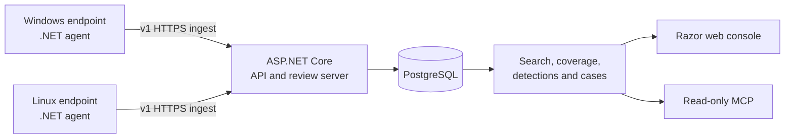

# Challenger SIEM


[](LICENSE)

Challenger SIEM is an open-source security telemetry pipeline under active development. It combines custom .NET endpoint agents, an ASP.NET Core ingestion and review server, PostgreSQL storage, and a server-hosted Razor web console. Windows is the most developed endpoint path; Linux collection is implemented in bounded tiers with higher-visibility sources kept behind explicit opt-in and approval gates.

> [!WARNING]
> Challenger SIEM is **not production-ready**. There is no supported production release, and the release-readiness checklist still requires real endpoint, database, browser, packaging, upgrade, and security-hardening evidence. Use it for development or controlled labs with synthetic data unless you have independently reviewed and accepted the risks.

The current project version is `1.11.0`, which remains on the unreleased development line. See the [changelog](CHANGELOG.md) and [release-readiness checklist](docs/release-readiness.md) for the evidence still required.

## Current state

| Area | Status | What exists today |
| --- | --- | --- |
| Server and storage | **Implemented; development-stage** | Versioned `/api/v1` ingestion and review APIs, PostgreSQL migrations, structured plus JSONB event storage, deduplication, search, source health, coverage, inventory, retention controls, and security-audit records. |
| Windows endpoint agent | **Implemented; lab validation outstanding** | Windows Event Log collection, durable SQLite queueing, acknowledgement-aware retry, channel positions, enrollment, heartbeats, source health, guarded installer workflows, and an optional Sysmon profile. |
| Linux endpoint agent | **Implemented in tiers; VM validation outstanding** | Default L1 system-journal collection, optional collection from all local journals already readable by the service identity, bounded inventory, opt-in L2 security families, approval-gated L3 integrity/process/socket/behaviour snapshots, and disabled-by-default L4 policy-posture drift, agent resource SLO, and declared-role journal coverage. L2-L4 remain canary-only pending approval and private soak evidence. |
| Web console | **Implemented; development-stage** | Role-aware login, overview, event search, assets, source health, coverage, alerts, cases, detections, dashboards, investigation graphs, retention/capacity views, administration, and a `soc-agent` workspace. |
| Detections and investigations | **Foundation implemented** | A bounded built-in rule catalog, prerequisite-aware evaluation, alert evidence, triage, cases, and graphs. This is not a comprehensive detection-content library or a finished SOC workflow. |
| MCP and AI-assisted review | **Optional** | Authenticated, role-scoped, read-only MCP tools and resources plus an optional `soc-agent` provider path. These surfaces do not authorize endpoint or SIEM configuration changes. |
| Production operations | **Not ready** | Production SSO, finalized TLS/mTLS guidance, signed release packaging, mature upgrades/migrations, scale qualification, and supported deployment/operations remain incomplete. |

## Telemetry available today

### Windows

- Core `Security`, `System`, and `Application` event channels.
- Optional PowerShell, Defender, Task Scheduler, WMI, Remote Desktop, WinRM, Firewall, Group Policy, Code Integrity, AppLocker, and Sysmon channels when present and readable.
- Host inventory, audit-policy snapshots, source-health state, queue/backoff state, and host timezone metadata.

Advanced Windows coverage depends on the endpoint role, enabled channels, permissions, and operator-approved prerequisites. The agent reports missing, denied, unsupported, stale, and degraded states instead of treating every configured source as healthy.

### Linux

- Cursor-based L1 system journal records for boot, kernel, systemd, authentication, and core-system activity, with a disabled-by-default option to include other local journals already readable by the non-root service identity.
- An opt-in L2 journal classification pack for login/session, SSH, sudo/su, schedulers, packages, firewall, kernel/security-module, service-change, and agent/log-tamper activity.
- Bounded read-only host and security-posture inventory.
- Approval-gated L3 metadata snapshots for agent self-integrity, process appearance/disappearance, TCP/UDP socket changes, and aggregate CPU, memory, load, disk, network, and pressure behaviour.
- Approval-gated L4 posture-baseline drift, rolling agent CPU/RSS/write SLO evidence with queue context, and fixed journal classifications for declared web, database, DNS, file-server, container-host, and identity-server roles.

The broader journal scope does not grant access, run as root, change groups or ACLs, or guarantee access to every user's journal. It can include high-sensitivity user-service text, command lines, paths, and identities; existing bounds and redaction remain defensive controls, not proof that arbitrary messages are secret-free. The L3/L4 collectors do not install packages, load kernel programs, change audit/firewall/authentication policy, capture network payloads, or inspect process file descriptors. L4 is reported only when L1-L3 are strictly healthy, the approved posture baseline and SLO sources are fresh, role applicability is resolved, and every applicable role source is healthy.

## Architecture



Endpoint events are written to a durable local queue before delivery. The server authenticates the agent, validates and deduplicates the batch, stores normalized fields with the raw JSON payload, and returns per-event acknowledgements. See [architecture](docs/architecture.md), [API contract v1](docs/api.md), and [schema design](docs/schema.md).

## Reliability and security foundations

- Queue-before-checkpoint and acknowledgement-before-delete delivery semantics.
- Bounded retry/backoff, poison-event handling, source gaps, queue pressure, and stale/offline reporting.
- Enrollment credentials separated from per-agent credentials; agent tokens are stored hashed server-side.
- Database-backed operator identities, exact roles, revocable sessions, CSRF protection, and role-aware field redaction.
- HTTPS required outside local development; plain HTTP is limited to explicitly controlled lab workflows.
- Destructive cleanup defaults to dry-run and requires explicit confirmation.
- Public examples and tests use minimal synthetic data.

These controls are foundations, not a claim of completed production hardening or independent security review.

## Known limitations

- The [release-readiness checklist](docs/release-readiness.md) is not complete, including real Windows and Linux endpoint evidence.
- Linux L2-L4 rollout requires private canary/soak approval. Broader journal scope does not backfill records older than the durable cursor or turn absent package/sudo activity into evidence. L3 snapshot polling can miss short-lived processes and connections, and the new L4 path has not yet completed its first private Linux VM acceptance run.
- Linux Audit Framework, eBPF, packet capture, DNS enrichment, process-to-socket attribution, and broad/live file-integrity monitoring are not implemented.
- Optional Windows channels require host support and may require separately approved configuration. Sysmon is not assumed to be installed.
- Detection content is deliberately small and prerequisite-aware; missing telemetry reduces confidence or suppresses rules.
- Production identity-provider integration, signed packages, deployment automation, HA/scale qualification, and mature upgrade guidance are unfinished.
- PostgreSQL 16+ is required, and the project currently provides no Docker or container deployment workflow.

The [milestone status](docs/milestones.md) tracks the implemented baseline and current next themes without treating planned work as shipped functionality.

## Evaluate locally

Prerequisites:

- .NET 8 SDK
- PostgreSQL 16 or newer, including `psql`
- Bash-compatible shell

From a clean checkout, build and run the non-database validation first:

```bash
dotnet restore Challenger.Siem.sln
./scripts/validate-repository-safety.sh
dotnet build Challenger.Siem.sln --no-restore
dotnet test Challenger.Siem.sln --no-restore --no-build
./scripts/validate-contracts.sh
```

PostgreSQL-backed integration tests are opt-in and report a skip reason when no disposable test database is configured.

For a local instance, create a private ignored `.local/dev.env` following the [development guide](docs/development.md), then apply and validate the schema:

```bash
./scripts/apply-schema.sh
./scripts/validate-schema.sh

read -rsp "Initial operator password: " SIEM_OPERATOR_PASSWORD
export SIEM_OPERATOR_PASSWORD
./scripts/operator-account.sh bootstrap --username local-admin --role admin
unset SIEM_OPERATOR_PASSWORD

./scripts/platform.sh start
./scripts/platform.sh status
```

Open the `urls` value reported by `platform.sh status` and append `/login`. The unmanaged fallback is `http://127.0.0.1:5081`; an operator-configured persistent Linux-agent integration service uses the stable `https://127.0.0.1:5443` endpoint. The [operator guide](docs/operators.md) covers the full flow, and the synthetic API/web smoke tests write their temporary responses only beneath ignored `.local/` paths:

```bash
./scripts/smoke-test-server.sh
./scripts/smoke-test-web.sh
```

Do not deploy an endpoint agent from the basic quickstart. Review the [Windows agent guide](docs/agent.md), [Linux agent guide](docs/linux-agent.md), applicable security design, and approval-gated validation runbook first.

## Public repository safety

Security telemetry is sensitive even when it does not look like a credential. Never commit or include in public issues or pull requests:

- passwords, tokens, cookies, private keys, certificates with private material, connection strings, or real agent settings;
- raw endpoint events, journal/Event Log exports, inventory, queue/state databases, captures, dumps, logs, or incident evidence;
- screenshots, API responses, or test output containing real hosts, users, addresses, software, or customer/lab data;
- ignored developer or operator-tooling state, local environment files, generated agent packages, or build/runtime artifacts.

Use hand-authored synthetic fixtures and keep all live validation evidence in ignored local paths. Run `./scripts/validate-repository-safety.sh` before staging and again against the staged index. See the [contributor guide](docs/contributors.md) for the complete publication checklist.

## Repository layout

```text
agent/WindowsAgent/     Windows endpoint agent
agent/LinuxAgent/       Linux endpoint agent
agent/Agent.Core/       Shared queue, transport, identity, and retry core
server/Siem.Api/        Ingestion/review API and Razor web console
shared/Contracts/       Shared versioned C# contracts
contracts/v1/           External JSON Schema contracts
docs/                   Architecture, operator, security, and contributor docs
examples/               Minimal synthetic request examples
scripts/                Build, schema, validation, smoke, and packaging helpers
tests/                  Unit, contract, integration, release-gate, and safety tests
VERSION                 Project version source of truth
CHANGELOG.md            Unreleased and released project changes
```

## Documentation

Start with the [documentation index](docs/index.md). Useful entry points include:

- [Architecture and scope](docs/architecture.md)
- [Local development](docs/development.md) and [operator guide](docs/operators.md)
- [Windows endpoint agent](docs/agent.md) and [Linux endpoint agent](docs/linux-agent.md)
- [Linux security/privacy design](docs/linux-agent-security.md), [passive telemetry contract](docs/linux-passive-telemetry.md), and [L4 coverage contract](docs/linux-l4-coverage.md)
- [API v1](docs/api.md), [schema](docs/schema.md), and [MCP](docs/mcp.md)
- [Release readiness](docs/release-readiness.md), [release gates](docs/release-gates.md), and [versioning](docs/versioning.md)
- [Dependencies and third-party licensing](docs/dependencies.md)

## Contributing

Contributions should be small, testable, safe for a public repository, and honest about validation status. Read the [contributor guide](docs/contributors.md) and [development guide](docs/development.md) before changing code, contracts, schemas, or endpoint behavior. Use synthetic fixtures only, preserve `/api/v1` compatibility unless deliberately introducing a new version, and document skipped validation with a reason.

Current priorities and deferred work are listed in [milestone status](docs/milestones.md).

## License

Project-owned source code and documentation are licensed under the [MIT License](LICENSE). Third-party dependencies and optional external tools retain their own license terms; see [dependencies and ownership](docs/dependencies.md).
