# Sanitized web-console demo

This page is a public-safe visual guide to the web review console. Every screenshot in this page was captured from synthetic issue-specific demo data, not from real endpoint telemetry.

## Screenshot data contract

Tracked screenshots must satisfy all of these rules:

- Synthetic agent IDs, hostnames, users, graph titles, messages, and raw JSON only.
- No review tokens, enrollment tokens, per-agent API tokens, connection strings, cookies, local browser profiles, shell history, private lab hostnames/users, real endpoint telemetry, event-log exports, or raw customer/client data.
- Browser page screenshots only; avoid browser chrome or OS UI that might reveal local account or path information.
- Raw API responses, cookie jars, Playwright traces, videos, temporary screenshots, and logs stay under ignored `.local/` paths.

The current gallery uses a synthetic agent similar to `issue-147-demo-agent` on `DEMO-WIN11` with a synthetic System event, source-health heartbeat, and investigation graph.

## Gallery

### Login

The login page is captured with an empty password field so no review token is visible.

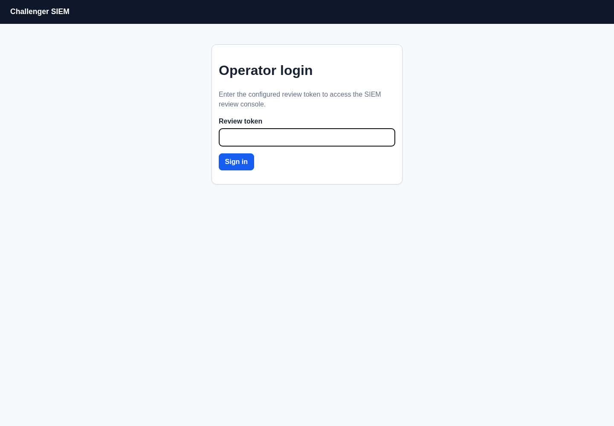

### Dashboard

The dashboard summarizes active/recent/stale/retired agents, queue observations, and recent ingest volume without listing hostnames.

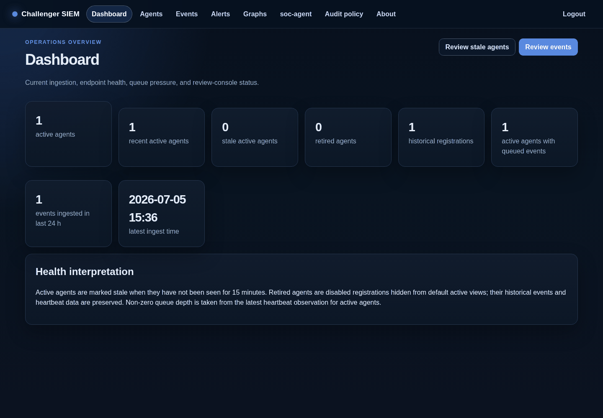

### Agent inventory

The inventory screenshot is filtered to the synthetic demo agent so no unrelated hostnames appear.

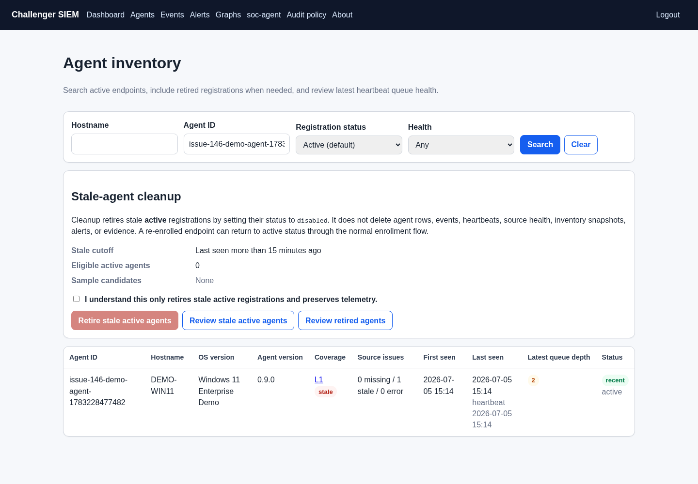

### Host coverage and source health

The host coverage page shows synthetic heartbeat/source-health rows for Windows Security, System, and Application channels.

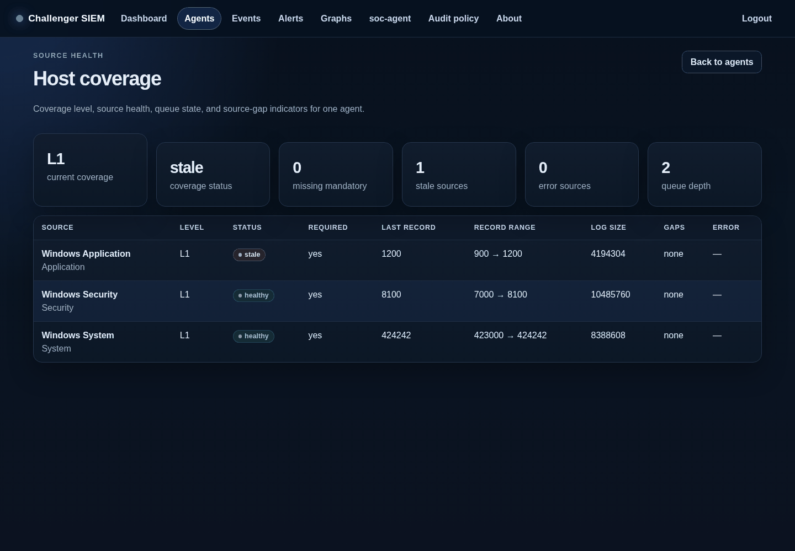

### Event search

Event search is filtered to the synthetic demo agent and unique marker.

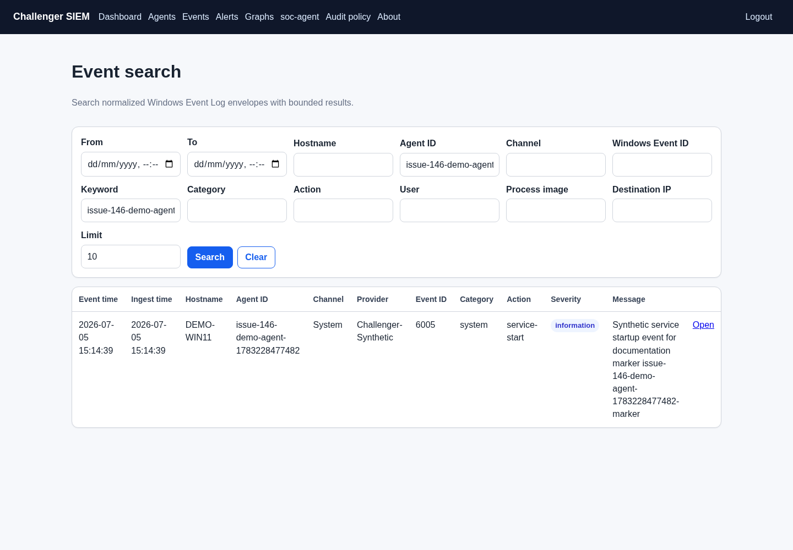

### Event detail

The detail page shows normalized fields, entities, message text, and raw JSON that were all generated from a synthetic payload.

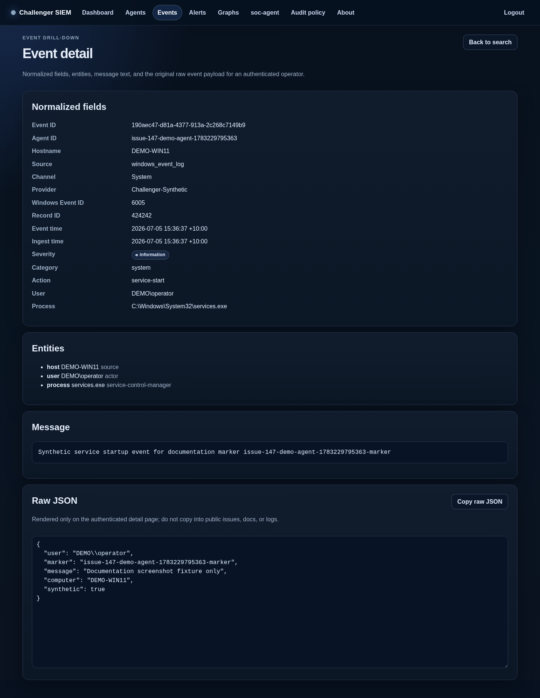

### Alerts

The alerts page currently demonstrates the alert review skeleton and empty-state behavior when no synthetic alerts match the selected filter.

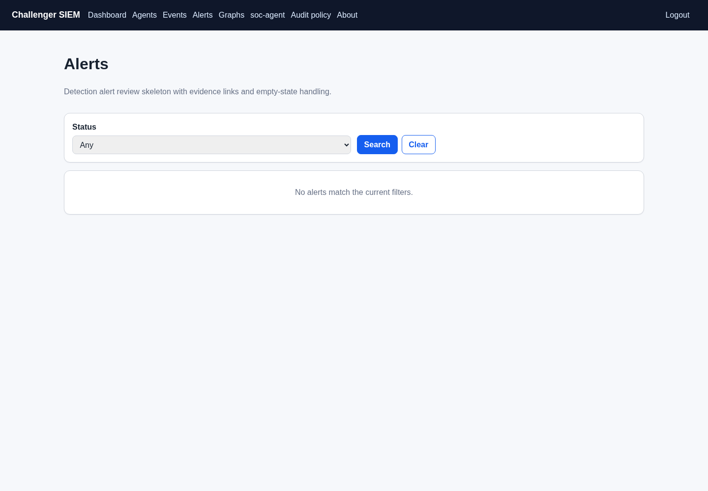

### Investigation graphs

The graph list and detail screenshots use a synthetic operator-managed graph with demo nodes and an edge.

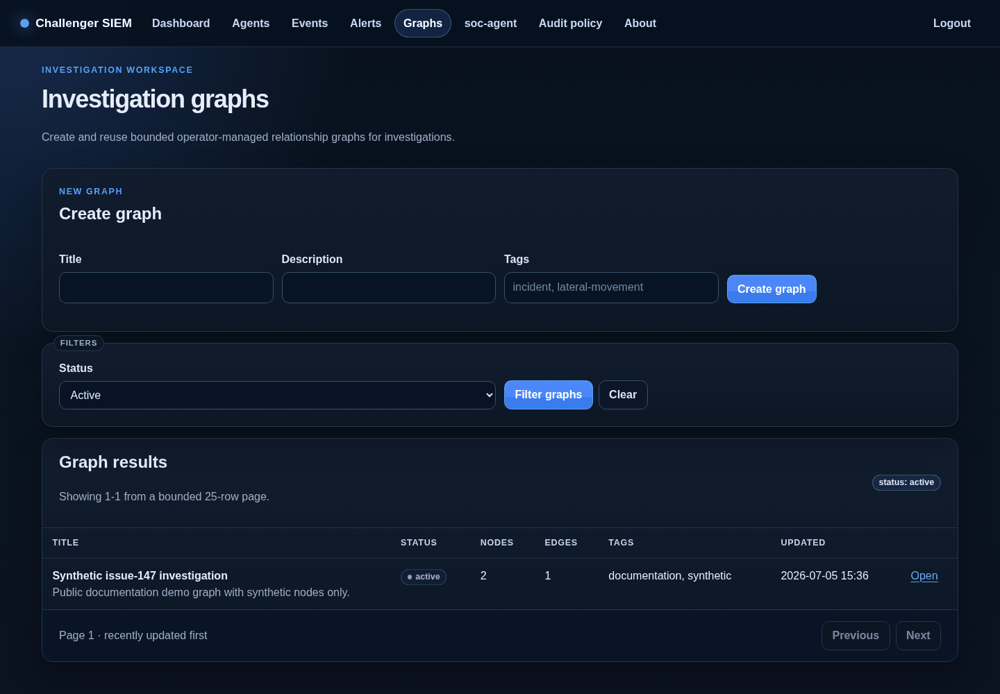

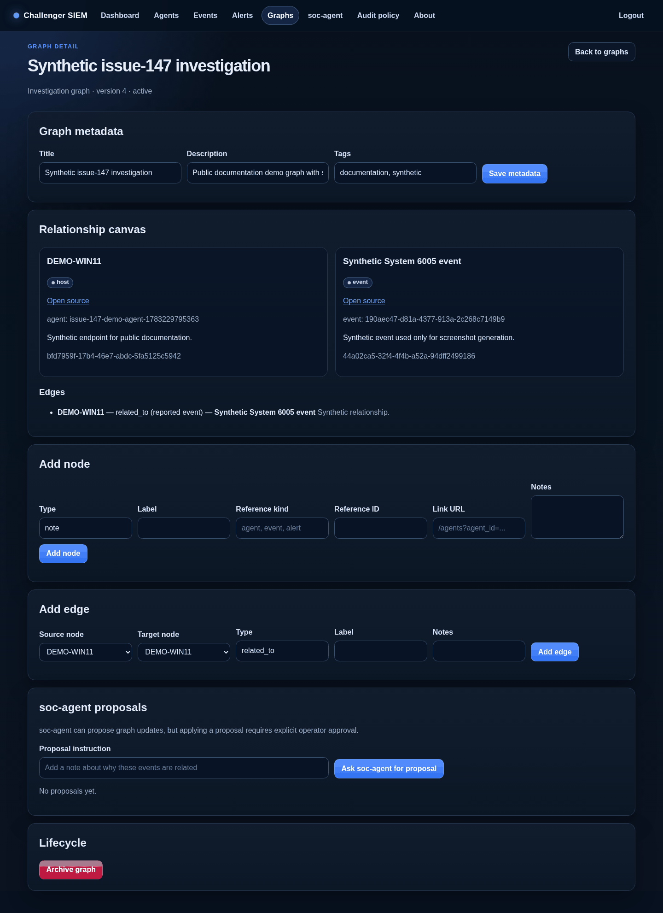

### soc-agent workspace

The `soc-agent` screenshot should show the widened live workspace layout with the provider status pill, a synthetic agent context, Recent chats controls, and sanitized live tool activity. Do not use real prompts or responses in public screenshots.

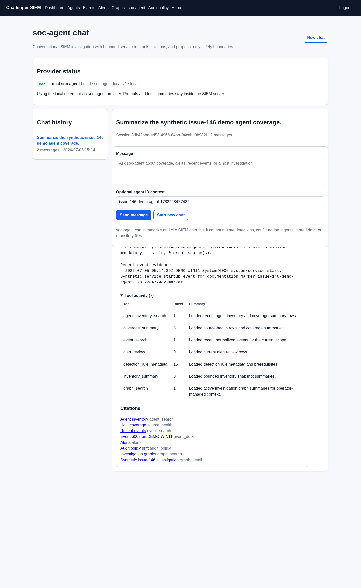

### Audit policy

The audit-policy page demonstrates empty-state handling when no synthetic audit snapshot has been reported.

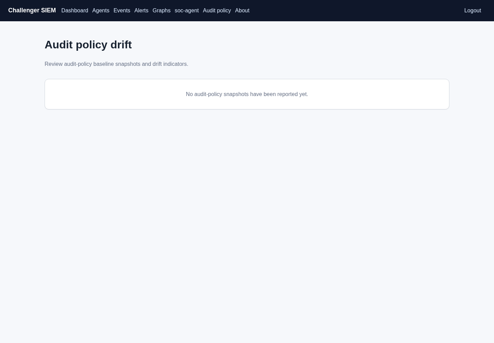

### System/about

The about page shows version, contract version, environment, and database connectivity status without secret values.

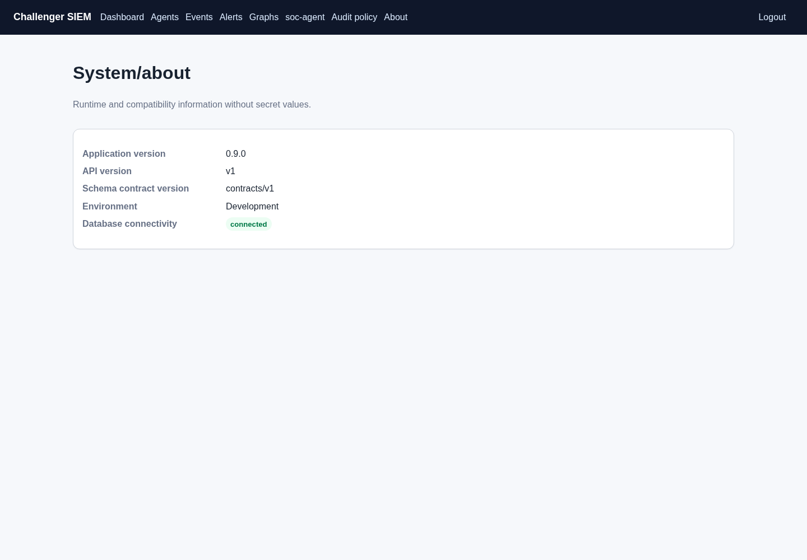

## Regenerating screenshots safely

Use this process whenever web UI changes make the screenshots stale:

1. Start from a clean branch and confirm there are no unintended tracked changes.
2. Source private local configuration from `.local/dev.env`; never print it.
3. Start the real API/web app against a development database.
4. Seed only synthetic data through public API flows:
   - Register a synthetic agent with `X-Enrollment-Token`.
   - Ingest a synthetic event with the returned per-agent API token.
   - Send a synthetic heartbeat/source-health payload.
   - Create a synthetic graph through the review API.
5. Use Playwright or another headless browser to log in with `Auth__ReviewToken`, navigate the pages, and capture page screenshots. Keep raw traces/videos/temp captures under `.local/`.
6. Filter data-bearing pages by the synthetic agent ID or unique issue marker.
7. Inspect every selected PNG before committing:
   - No token/cookie/connection string.
   - No real hostname, username, IP address, event payload, browser profile, local path, or lab telemetry.
   - Raw JSON is synthetic and minimal.
8. Save selected images under `docs/assets/web-console/` with stable descriptive names and update this page if routes or captions change.
9. Run a local markdown link/image check and browser E2E validation for the affected web paths.

## Browser E2E coverage used for this gallery

The gallery was validated with a headless browser against the real redesigned app and covered:

- `/login` unauthenticated page and successful login redirect.
- Dashboard `/`.
- `/agents` filtered inventory and `/agents/detail` source-health detail.
- `/events` filtered search and `/events/detail`.
- `/alerts` alert skeleton.
- `/graphs` and `/graphs/detail` with a synthetic graph.
- `/soc-agent` live workspace, `/audit-policy`, and `/about`.
- Logout and unauthenticated redirect/denial behavior.
- Responsive-width smoke coverage, visible focus behavior, active navigation state, and lightweight CSS/page budget checks.

See [web.md](web.md) for page behavior and [contributors.md](contributors.md#documentation-maintenance-checklist) for the screenshot maintenance checklist.
